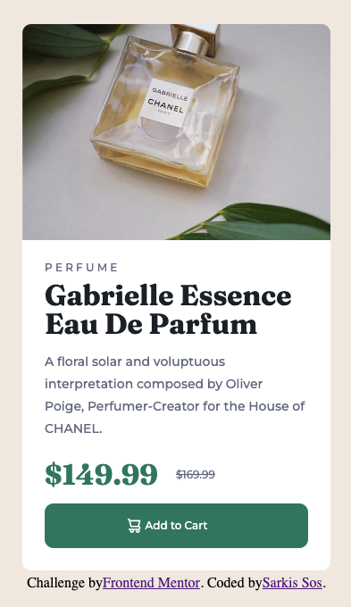

# Frontend Mentor - Product preview card component solution

This is a solution to the [Product preview card component challenge on Frontend Mentor](https://www.frontendmentor.io/challenges/product-preview-card-component-GO7UmttRfa). Frontend Mentor challenges help you improve your coding skills by building realistic projects. 

## Table of contents

- [Overview](#overview)
  - [The challenge](#the-challenge)
  - [Screenshot](#screenshot)
  - [Links](#links)
- [My process](#my-process)
  - [Built with](#built-with)
  - [What I learned](#what-i-learned)
  - [Useful resources](#useful-resources)
- [Author](#author)

## Overview

### The challenge

Users should be able to:

- View the optimal layout depending on their device's screen size
- See hover and focus states for interactive elements

### Screenshot




### Links

- Solution URL: [Github](https://github.com/Sarkis-S/product-preview-card-component)
- Live Site URL: [Netlify](https://unrivaled-arithmetic-8d6afa.netlify.app/)

## My process

This was a simpler component as there are only two separate containers. The structure of the HTML was straightforward. However, the challenge for me as I strive for pixel perfectness may be swapping out two different images. Once I have that figured out it's pretty much styling all the way through. I will use a ruler to get the closest dimensions.

### Built with

- Semantic HTML5 markup
- CSS custom properties
- Flexbox
- Mobile-first workflow

### What I learned

This one is a little tricky with regards to image swapping for responsiveness. I've learned of several ways to do so. Starting with the less preferred option, which involves creating a div container and setting its background image within:

```
#div {
  background: url(star_img.jpg);
  background-size: 200px 100px / Contain / Cover / etc
  background-repeat: no repeat
}
```

The problem with this approach; especially when combined with media queries is that the image ratio will not scale properly to browser window adjustments. Without specifying a different image with precise scaling, the image will leave a concerning disproportionate white space.

Also, we have to consider accessibility. It's simply better to use an image tag for screen readers and provide an `alt` text for search engine indexing as opposed to a simple div with a background image. It simply doesn't provide anything meaningful.

The second method was to include two separate image, but use CSS to hide or unhide the image block upon resize, but its use is depended on your design. It did not work for me in this challenge.

What did work for me was this solution:

```
// index.html


// styles.css
@media screen and (min-width: 705px) {
  .image {
    content: url('./images/image-product-desktop.jpg');
  }
}
```

I have commented out the solution above in my challenge for future references. The best solution is this:

```
<picture>
  <source media="(max-width: 704px)" srcset="image-mobile.jpg" />
  <source media="(min-width: 705px" srcset="image-desktop.jpg" />
  
</picture>
```

This is the preferred method, but is supported by modern browsers. The full benefits of this method can be read in MDN docs which I have provided below.


### Useful resources

- [MDN](https://developer.mozilla.org/en-US/docs/Learn/HTML/Multimedia_and_embedding/Responsive_images) - Talks about responsive images. A must read!
- [Stack Overflow Discussion](https://stackoverflow.com/questions/30460681/changing-image-src-depending-on-screen-size) - You can see other examples here that I've tried my hands on.

## Author

- Website - [Sarkis Sos](https://github.com/Sarkis-S)
- Frontend Mentor - [@Sarkis-S](https://www.frontendmentor.io/profile/Sarkis-S)
